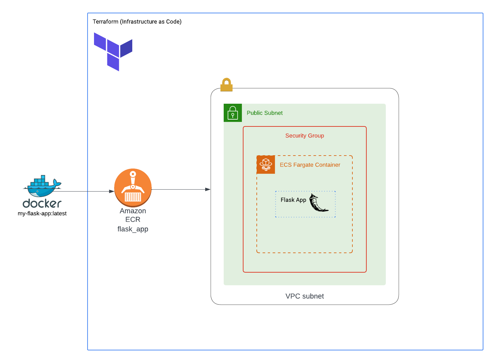

# Player Finder Flask

## Project Overview
Player Finder Flask is a cloud-based web application designed to help identify similar football players in the English Premier League (EPL) using machine learning clustering. The app processes player data and uses K-Means clustering to provide player similarity insights based on their performance statistics. This application is designed for continuous adaptability with regularly updated data.

## Features
- **Player Similarity Identification**: Utilizes machine learning algorithms to find and suggest players with similar profiles.
- **Dynamic Web App**: Built with Flask and integrated with a pre-tuned machine learning model for real-time predictions.
- **Data Processing**: Efficient data handling using Pandas and NumPy.
- **K-Means Clustering**: scikit-learn's K-Means algorithm clusters players based on their performance metrics.
- **Model Management**: Pre-trained models are managed with Joblib, allowing for seamless integration of the clustering algorithm.
- **Data Visualization**: Player insights are presented with Plotly and Seaborn, providing an intuitive user experience.
  
## Technologies Used
- **Python**: Core programming language for backend development.
- **Flask**: Micro web framework for serving the application.
- **Pandas & NumPy**: Libraries used for data analysis and processing.
- **scikit-learn**: For machine learning, specifically K-Means clustering.
- **Joblib**: For loading and managing the pre-trained model.
- **Plotly & Seaborn**: Used for rich data visualizations.
- **Docker**: Containerized the application to ensure consistency across environments.
- **Terraform**: Infrastructure-as-Code tool for provisioning AWS resources.
- **AWS Services**: Including Amazon ECS (Fargate), VPC, ECR, and Security Groups.

## Architecture Flow




## Architecture Breakdown:

- **Docker**: The application is containerized using Docker for consistency across environments.
- **Terraform**: Used for automating the deployment of AWS infrastructure, ensuring reliable and repeatable setups.
- **VPC**: Amazon Virtual Private Cloud is configured to isolate the application's infrastructure securely.
- **Amazon ECR**: The Docker images for the application are stored in Amazon Elastic Container Registry.
- **Public Subnet**: Provides internet access to the Flask app deployed on AWS.
- **Security Group**: Defines and controls inbound/outbound traffic to the Flask application.
- **Amazon ECS Fargate**: The Flask app is deployed on Amazon ECS Fargate, a serverless container service for smooth scalability and management.

## Setup Instructions

### Prerequisites
- Python 3.x installed
- Docker installed
- AWS account
- Terraform installed

### Local Development
1. Clone the repository:
   ```bash
   git clone https://github.com/your-repo/player-finder-flask.git
   cd player-finder-flask
   ```

2. Set up the Python environment:
   ```bash
   python -m venv env
   source env/bin/activate  # For Linux/Mac
   .\env\Scripts\activate  # For Windows
   pip install -r requirements.txt
   ```

3. Run the Flask app locally:
   ```bash
   flask run
   ```

### Docker Deployment
1. Build the Docker image:
   ```bash
   docker build -t player-finder-flask .
   ```

2. Run the Docker container:
   ```bash
   docker run -p 5000:5000 player-finder-flask
   ```

### AWS Deployment Using Terraform
1. Initialize Terraform:
   ```bash
   terraform init
   ```

2. Apply Terraform configurations:
   ```bash
   terraform apply
   ```